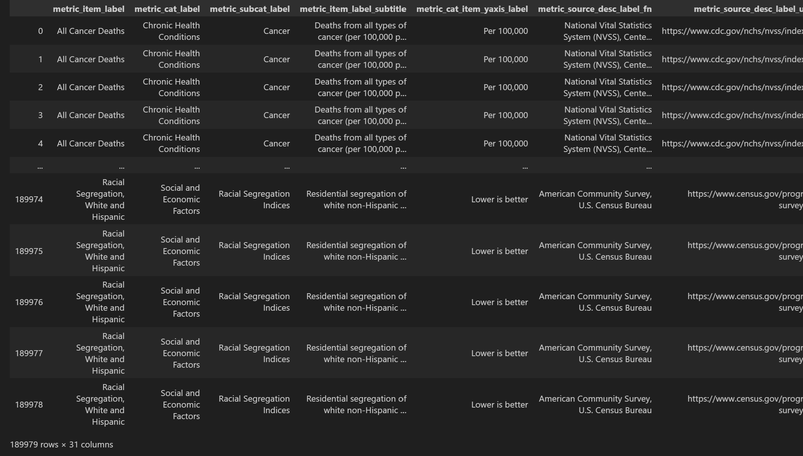
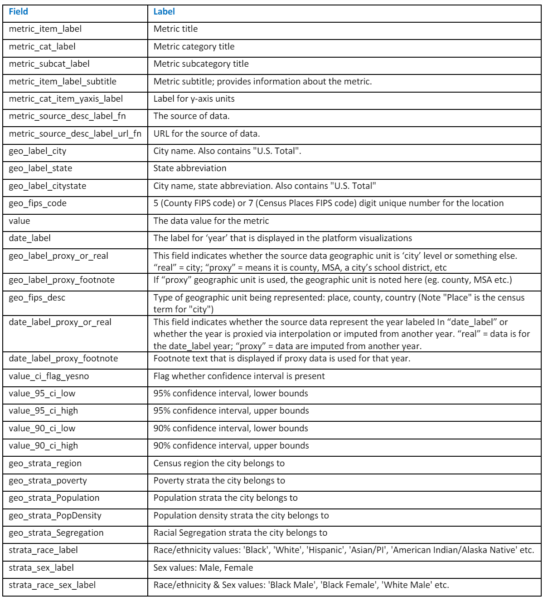
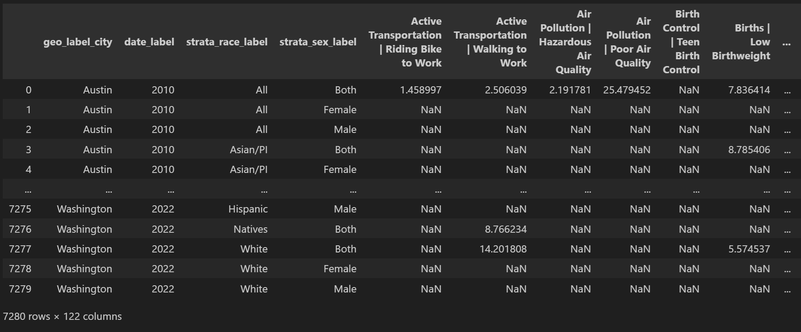
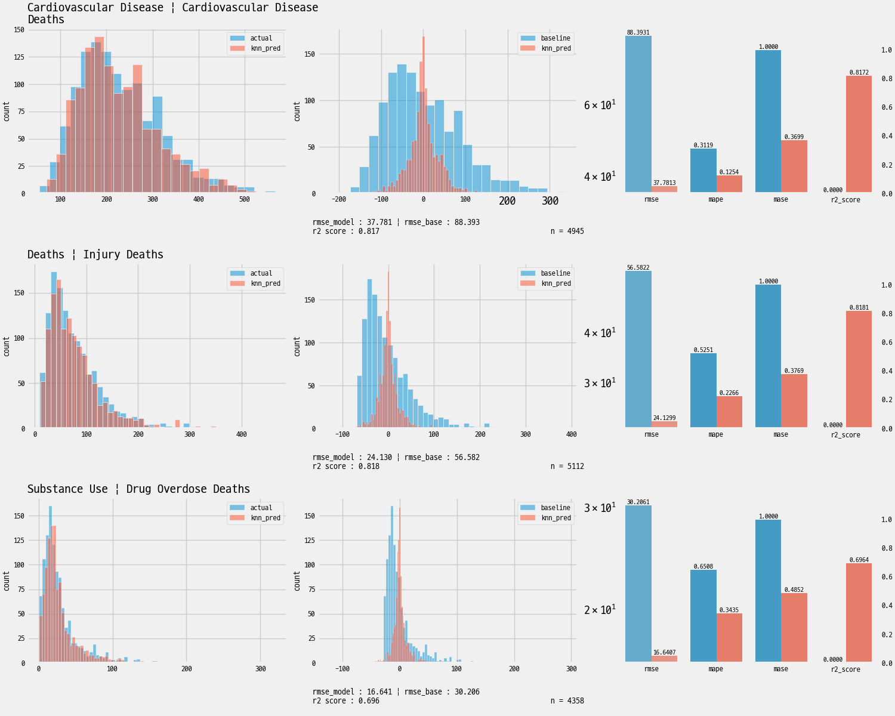
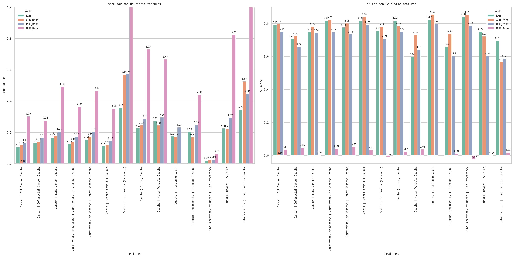
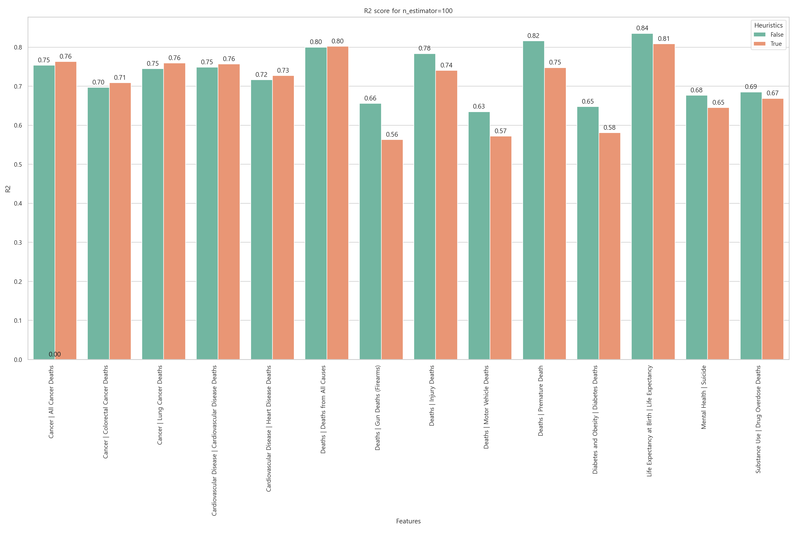
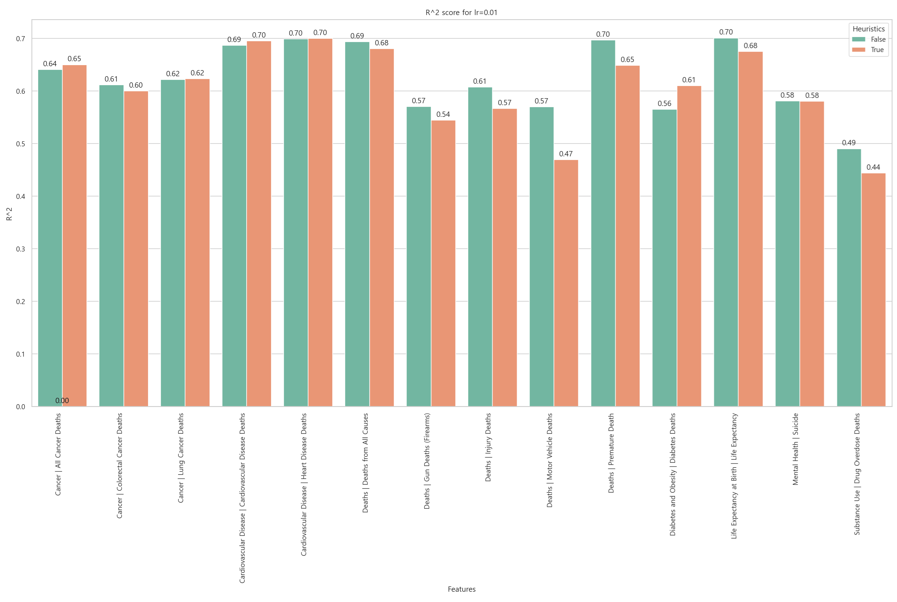
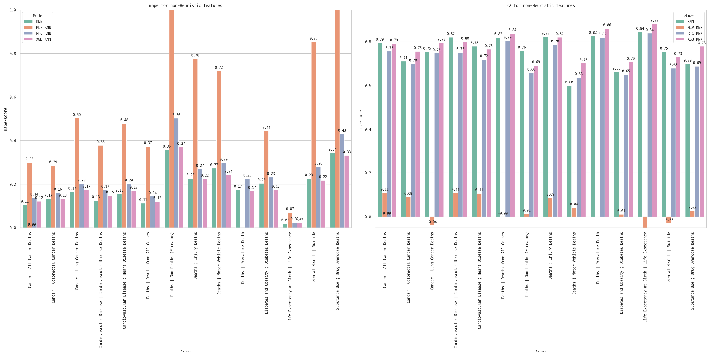
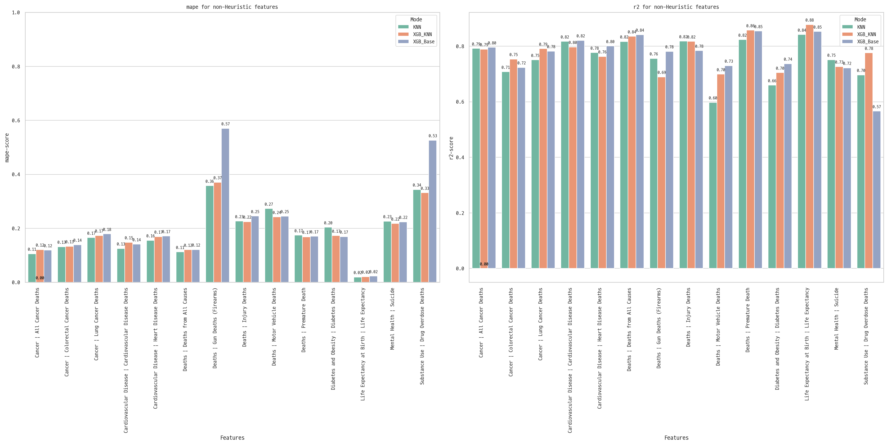

# 미국 대도시 보건 데이터셋을 기반으로 한 질병 발병 및 사망 통계 예측 AI 모델

**프로젝트 구성원** : 김남덕, 김명윤, 신수웅, 오도은, 최재원 / [**발표 slide 자료**](https://docs.google.com/presentation/d/1LSaatqx-LFgNHZMdRt6-Qej-CfJq610s0M-9tymdhk0/edit?usp=sharing)

**사용된 스킬 셋** : NumPy, Pandas, Matplotlib, Scikit-learn, xgboost, PyTorch

<!--**초록**-->

## 1. 프로젝트 개요

### 프로젝트 배경

- 질병발생 예측 연구는 미래 질병 관리를 위한 중요한 분야
- 팀원들의 도메인 지식과 관련된 분야로, 정형 데이터를 활용한 분석 프로젝트

## 2. 목적

- 미국 대도시의 생활 환경 데이터를 기반으로 주요 질병의 발병 및 사망 통계값을 예측하는 모델을 개발하여 예방의학 발전을 도모
- Random Forest, k-NN, XGBoost 및 Multi-Layer Perceptron(MLP) 모델을 이용하여 예측
- 적절한 성능지표를 이용하여 회귀 예측에 적합한 모델링 개발

## 3. 데이터셋

### 1) 데이터 개요

- [Big Cities Health Inventory(BCHI) Dataset](https://bigcitieshealthdata.org/)
- 미국 대도시들의 각 인종-성별 집단에 대해 건강, 기후 및 환경, 경제적 불평등 등 건강 통계 및 건강에 영향 줄 수 있는 다양한 통계 항목이 집계되어 있음

### 2) [데이터 셋 구조](./research/240614_step0.ipynb)

- 미국 전역 및 35개 대도시에 대한 2010~2022년의 통계 자료
- 총 189,979건의 통계 기록(이하 record)으로 구성됨


_그림 1. BCHI 데이터 셋_

- 각 record는 특정 지역 및 연도의 한 층화된 집단에 대한 통계이며, BCHI 데이터셋에서 row에 해당함
  - e.g. _Minneapolis, 2015, All, Female, Midwest, Less poor cites, Smaller, Lower pop.density, Less Segregated, All Cancer Death, 157, per 100,000_ :
  
    "중서부, 덜 빈곤한, 인구규모가 작은, 낮은 인구밀도, 인종 별 거주지 분리 정도가 낮은 도시인 Minneapolis에서 2015년에 인종 상관없이 여성에 대해 All Cancer Death를 조사한 결과, 십만명당 157명"
- column은 조사가 진행된 도시 및 시기, 층화된 집단에 대한 정보, 통계 항목과 분류, 통계값 및 단위, 통계 조사에 대한 기타 정보로 총 31개가 있음
  - 조사가 진행된 도시 및 연도 : 'geo_label_city'은 35개 도시 및 미국 전역, 'date_label'은 13개년으로 분류됨
    - e.g. _Minneapolis, 2015_ : 2015년 Mineaolis에서 집계 된 통계 조사
  - 각 record의 표본은 인종, 성별, 도시의 별로 층화 되어 있음
    - 각 record에 대하여 층화에 관련된 정보는 각각의 column에 기록됨
    - **인종-성별**
      - **인종** : White, Black, Hispanic, Asian/PI, Natives 및 All (i.e. 인종에 대해 층화되지 않음)
      - **성별** : Female, Male 및 Both (i.e. 성별에 대해 층화되지 않음)
      - 가능한 경우의 수는 총 18종이지만, 각 record의 표본들은 16종의 인종-성별 집단으로 분류됨
      - e.g. _All, Female_ : 인종 상관 없이 전체 여성
    - **도시의 특성** : 5개의 특성이 사용 됨
      - 지역/ 경제적 빈곤/ 인구/ 인구밀도/ 인종별 거주지 분리 정도
      - 도시 특성 중 지역 외에는 모두 binary ordinal
      - 모두 종합하면 32개의 도시 유형이 가능함
      - BCHI 데이터 셋의 35개 도시는 19 종의 도시 유형으로 분류 됨
      - e.g. _Midwest, Less poor cites, Smaller, Lower pop.density, Less Segregated_ :
        중서부, 덜 빈곤한, 인구규모가 작은, 낮은 인구밀도, 인종 별 거주지 분리 정도가 낮음 (Columbus, Kansas City, Minneapolis 등)
    - [인종, 성별 층화를 고려하면 결측률이 낮은 통계 항목은 10여개에 불과하지만, 참고할 만한 최소한의 데이터는 많은 수의 통계 항목이 가지고 있는 것을 확인](./research/240619_check_missing_entire.ipynb)
    - [지리적 정보에 관한 칼럼](./research/240619_EDA_geo.ipynb) 조사 결과, 통계 항목에 상관없이 도시의 특성에 대한 정보가 일관되게 기록된 것을 확인
  - **통계 항목과 분류, 통계값 및 단위**
    - 통계 항목은 총 118종이 있으며 'metric_item_label' column에 기록되어 있으며 값은 'value' column에 기록되어 있음
    - 통계 항목은 category 및 sub-category로 분류되어 있음
    - value는 모두 numeric
    - [통계값의 단위와 스케일 및 분포 간의 관계](./research/240619_variance_feature.ipynb)
      - 통계값 단위는 총 19종이며, 단위 종류 별로 최대 72종에서 최소 1종의 통계 항목이 해당됨
      - 일반적으로 단위가 같으면 통계값의 스케일이 유사했지만, 단위가 같을지라도 통계 항목에 따라 값의 스케일에서 큰 차이가 나는 경우도 많았음
    - e.g. _All Cancer Death, 157, per 100,000_ :
      All Cancer Death(모든 암 종류를 포괄한 사망자 수)에 대한 조사이며, per 100,000 단위의 집계값이 157임을 의미
  - 통계 조사에 대한 기타 정보 : 신뢰구간, 데이터의 출처 등으로 구성
    - [신뢰 구간 관련 칼럼에 대한 데이터 조사](./research/240617_ciEDA.ipynb) 결과, 신뢰 구간 관련 칼럼의 결측 여부로 데이터를 배제하는 것은 득보다 실이 크다고 판단
    - 조사 과정에서 데이터셋에 포함된 대다수의 통계 항목이 연도보다 도시의 특성에 따라 값의 분포가 변화하는 것을 $\chi^2$ 검정을 통해 확인



_표 1. BCHI dataset의 column들_

## 3. 문제 설정

**문제** : 도시의 특성/인종/성별로 층화된 인구집단에 대하여, 관련있는 여러 통계 항목 데이터를 바탕으로 특정 질병의 발병 및 사망에 관한 통계를 예측하고자 함

- e.g. _도시의 특성,인종,성별로 층화된 인구집단에 대하여, 층화된 정보 및 Adult Physical Inactivity, Diabetes, Teen Obesity, Adult Obesity, Population : Seniors, Income : Poverty in All Ages 등의 통계값를 이용하여, All Cancer Deaths 통계값을 예측_

### 1) 실험 설계

- ```sklearn.train_test_split```을 사용하여 train 80%, test 20% 비율로, [연도를 기준으로 층화해 분리](./model/data_prep.ipynb)
- 총 3가지 측면에서 실험을 진행함
  - **모델 종류 별 비교**
    - [k-NN](./preprocess_code/240622_fill_with_knn.py) , [Random Forest](./model/random_forest.ipynb), [XGBoost](./model/boost.ipynb), [MLP](./model/mlp.ipynb) 모델 간의 성능을 비교
    - k-NN : 독립 변수로 각 record 별 표본의 층화 기준(race,sex,year,city의 특징)만을 사용
    - Random Forest, XGBoost, MLP
      - 독립변수로 각 record 별 표본의 층화기준(도시의 특성 5개,인종,성별),연도 및 해당 표본을 대상으로 한 기타 통계 항목을 사개개
      - 독립변수로 사용한 기타 통계 항목(이하 참고 통계 항목)은 BCHI 데이터 셋에 포함된 다른 통계 항목.
  - **참고 통계 항목의 양**
    - 종속변수 별로 각각 참고 통계 항목을 10~30종으로 제한한 경우와 참고 통계 항목의 수를 제한하지 않고 활용하여 예측하는 것 사이에 비교
    - 참고 통계 항목 선별 과정 등 세부적인 내용은 참고 통계 항목 부분에서 후술
  - **단일 모델 vs 복합 모델**
    - Random Forest, XGBoost, MLP에 대해서 진행
    - 복합 모델 : 각 통계 항목 별로 k-NN 모델을 이용하여 결측치를 보간한 데이터를 사용한 경우
    - 단일 모델
      - 결측치 보간에 k-NN 모델을 사용하지 않은 경우
      - Random Forest, XGBoost는 결측치를 가공하지 않고 모델에 투입
      - MLP의 경우는 결측치가 있으면 학습이 불가능하여 별도의 처리 가함
    - 세부적인 내용은 전처리 부분에서 후술
- Random Forest, XGBoost, MLP 학습을 할 때 grid search를 이용해 각 모델 별로 가장 높은 성능을 내는 hyper parameter 탐색

### 2) 종속 변수 설정

**기준** : 결측치를 채울 수 없는 점을 고려하여, 결측률이 낮고 주요한 질병/사망요인에 대한 통계 항목을 종속 변수로 설정

|분류| 종속 변수|
|-------|------------------|
|Cancer | All Cancer Deaths|
|Cancer | Colorectal Cancer Deaths|
|Cancer | Lung Cancer Deaths|
|Cardiovascular Disease | Cardiovascular Disease Deaths|
|Cardiovascular Disease | Heart Disease Deaths|
|Deaths | Deaths from All Causes|
|Deaths | Gun Deaths (Firearms)|
|Deaths | Injury Deaths|
|Deaths | Motor Vehicle Deaths|
|Deaths | Premature Death|
|Diabetes and Obesity | Diabetes Deaths|
|Life Expectancy at Birth | Life Expectancy|
|Mental Health | Suicide|
|Substance Use | Drug Overdose Death|

_표 2. 사용된 종속 변수 목록_

### 3) 참고 통계 항목 설정

- 각 종속 변수 별로 별개의 참고 통계 항목을 선정
- 종속변수를 제외한 통계 항목 중에서 독립변수 선정
- 도메인 지식을 활용하여 종속 변수 별로 해당하는 통계 항목 선별
- [통계적 접근으로 독립변수로 활용하면 안될 통계 항목 선별](./research/240619_indvar.ipynb)
- [종속 변수 별로 결과를 직접 드러낼 수 있는 일부 통계 항목 제거](./research/set_lists.ipynb)

|종속 변수|참고 항목|
|-------|------------------|
| All Cancer Deaths|Adult Physical Inactivity, Diabetes, Teen Obesity, Adult Obesity, Population : Seniors, Income : Poverty in All Ages, e.t.c.|
| Colorectal Cancer Deaths|Teen Obesity, Adult Obesity, Health Insurance : Uninsured in All Ages, Births : Low Birthweight, Dietary Quality : Teen Soda, e.t.c.|

_표 3. 각 목표항목 별로 설정된 참고 항목 후보의 예시_

## 4. 전처리

### 1) 전체 과정

- raw data를 pivot table로 변형, k-NN 모델로 결측치 보간, 독립변수를 대상으로 scaling 진행, nominal 데이터에 대한 encoding 등을 사용
- 도시,인종,성별로 층화된 표본에 대해 13개 연도 총 7280개의 표본을 row로, 각 표본의 층화 정보와 118종의 통계 항목을 column으로 한 pivot table로 변형


_그림 2. pivot table 변형 후 데이터_

### 2) 결측치 정의

- 데이터 셋에 포함 된 16종의 인종-성별 인구 집단, (19종 도시 유형에 해당하는) 35개 도시, 13개 년도의 7280개 표본에 대하여 정의
  - 데이터 셋에 포함되지 않은 2종의 인종-성별 인구 집단, 13종의 도시 유형에 대해서는 결측치로 정의하지 않음
- 118종의 통계 항목에 대하여, 분포의 형태 및 집계 데이터임을 감안하여 이상치 기준은 설정하지 않음
- 인종-성별로 층화된 통계에 대해 결측치를 해결하는 것이 주요한 과제

### 3) 결측치 보간

- 각 통계 항목에 대해서 인구/성별/도시의 특성에 따라 층화된 정보를 바탕으로 통계치를 예측하는 모델을 만들어, 결측치를 보간하고자 함
  - 가장 가까운 집단에서의 값을 참고한다는 직관에 따라 k-NN regressor 사용
  - [각 층화 집단 특성에서의 거리에 weight를 반영한 custom metric](./research/240620_how_to_fill_missing_knn.ipynb)을 구현
  - Euclidean 혹은 weight가 반영되지 않은 custom metric에 비해 유의미하게 좋은 성능을 보임
  - weight의 값은 도메인 지식과 EDA 결과를 바탕으로 휴리스틱하게 결정
  - 하지만 custom metric의 경우 최적화가 덜 되어 train 및 predict에서 걸리는 시간이 통계 항목 하나 당 분 단위로 걸리는 단점이 있음
  - [Decision Tree](./research/240620_how_to_fill_missing_with_dt.ipynb)를 이용한 모델도 구현해본 결과, k-NN에 준하는 성능을 얻음

>$d_{\text{record}}(A,B) = \left\Vert\left(w_i \cdot d_i(A,B)\right)_i \right\Vert_7$ , when $A,B$ are records, $d_i(A,B)$ are distance between $A$ and $B$ in a property $i \in \{\text{city, race, sex, year}\}$, and weights $\left(w_\text{city}, w_\text{race}, w_\text{sex}, w_\text{year}\right)$ are $(0.4,0.5,0.5,0.1)$. Especially, $d_\text{city}(A,B) = \Vert d_j(A,B)\Vert_5$ when $j$ are 5 features of a city for stratification.

_수식 1. k-NN regression에 사용된 custom metric_


_그림 3. train셋의 평균을 baseline으로 하였을 때, k-NN regressor 적용 결과 분석 예시 (실제 및 예측값 분포/오차의 분포/성능 지표)_

## 5. [모델 학습 결과 및 평가](./model/compare_results.ipynb)

<!--다이어그램 추가-->


- 모델 성능은 RMSE, MAPE, $R^2$ score 등을 활용하여 평가
  - RMSE는 MAPE, $R^2$ score에 비해 값 스케일의 영향을 많이 받아 이번 조사에서는 상대적으로 덜 적합했음
- XGBoost 모델과 전처리 과정에서 개발한 k-NN 모델이 최종적으로 가장 우수한 성능을 보였음
  - 거의 모든 종속 변수에 대해 k-NN 모델과 XGBoost모델의 성능은 MLP, RandomForest 모델에 비해 성능이 좋았음
  - 전반적으로 k-NN은 MAPE 측면에서, XGBoost는 $R^2$ score 측면에서 상대방 보다 성능이 좋았지만, 대부분의 종속 변수 항목에서 다른 모델들의 성능에 비해 큰 차이는 없었음
  - XGBoost 모델은 train/predict에 걸리는 시간이 k-NN 모델에 비해 압도적으로 짧게 걸렸음


_그림 4. 단일 Model 간의 성능 비교_

- Random Forest와 XGBoost 학습에서 대부분 참고 통계 항목을 제한하지 않는 쪽이 성능이 다소 좋았음

 _그림 5-1. 문제설정 부분에서 정한 후보로 참고 통계 항목 제한 여부에 따른 Best Random Foreset Model의_ $R^2$ _score 성능 비교_

 _그림 5-2. 문제설정 부분에서 정한 후보로 참고 통계 항목 제한 여부에 따른 Best XGBoost Model의_ $R^2$ _score 성능 비교_

- k-NN 모델의 전처리를 이용한 RFC, XGBoost의 모델 학습이 이용하지 않은 것에 비해 전반적으로 성능이 더 좋았음
  - XGBosst의 경우 대개 k-NN 전처리를 사용한 쪽이 전반적으로 성능이 높았음
  - 하지만 특정 종속 변수에서는 큰 차이가 났고, 동시에 MAPE와 $R^2$ score 사이에 상반된 결과를 보였음


_그림 6-1. Best Model 간의 성능 비교_


_그림 6-2. k-NN, k-NN 전처리를 사용한 XGBoost, 사용하지 않은 XGBoost 간의 성능 비교_

## 6. 결과 분석

- 인종, 성별, 도시 관련 특성에 대한 정보로만 학습한 k-NN의 성능이 좋았던 것과 Random Forest의 Feature Importance 분석 결과를 바탕으로 하여, 보건 통계를 예측할 때 인종, 성별이 주요한 역할을 하는 것을 확인
- 데이터 전처리 단계에서 단순한 모델을 이용해 결측치를 보간하는 것으로, 최종 모델의 성과를 높히는 것이 가능함을 확인함
  - 하지만 전처리 단계에서 사용한 모델의 성능에 최종 모델의 성능이 의존할 수 있는 딜레마가 존재
- RMSE, MAPE, $R^2$ score 등의 공통적인 경향 및 각 성능 지표의 차이점에 대해 생각해볼 수 있었음

## 7. 결론 및 향후 연구

- 인종, 성별에 대한 정보가 보건 데이터 분석 및 예측에서 매우 주요한 정보임을 확인함
- 층화된 집단 별로 여러 질병의 발병률과 사망률에 대한 예측 결과는 보건 정책 수립과 자원 배분에 중요한 자료로 활용될 수 있음
- 각 통계 자료에 대하여, 분포의 특징을 보다 세부적으로 고려해 하이퍼 파라미터를 조절하여 k-NN 모델을 개선할 수 있음
- k-NN 전처리 모델을 개선하였을 때, 다른 통계항목도 학습에 고려한 모델의 성능이 어떻게 달라지는지 실험해볼 수 있음

### References

1. 한국인 유전체분석사업을 통한 한국인 유전체변이 정보 기반의 질병 발생 위험도 예측 모형 고도화 연구- 당뇨병 예측모형을 중심으로-, 질병관리청, 2024
2. Big Cities Health Inventory (BCHI) data platform
TECHNICAL DOCUMENTATION, [https://bigcitieshealthdata.org/](https://bigcitieshealthdata.org/)
3. [Scikit-learn 1.5.0 documentation](https://scikit-learn.org/stable/user_guide.html)
4. Harnessing multimodal data integration to advance precision oncology, Nature Reviews Cancer, 22, 2022, 114-126
5. Pulungan, A. F., Zarlis, M., & Suwilo, S. (2019). Analysis of Braycurtis, Canberra and Euclidean Distance in KNN Algorithm. Sinkron : Jurnal Dan Penelitian Teknik Informatika, 4(1), 74-77
